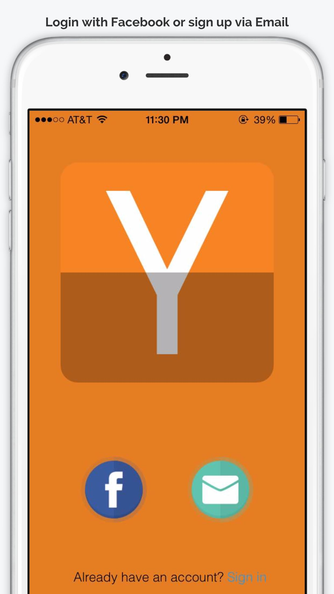
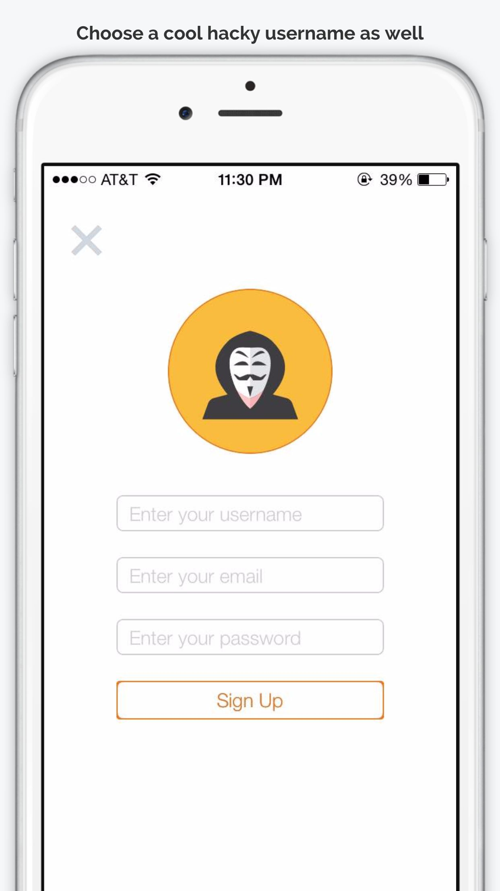
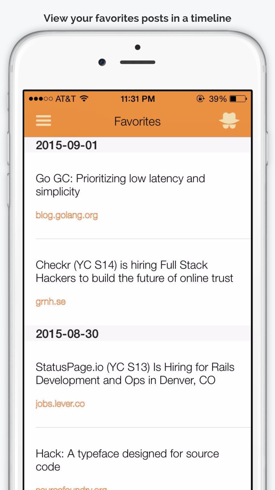
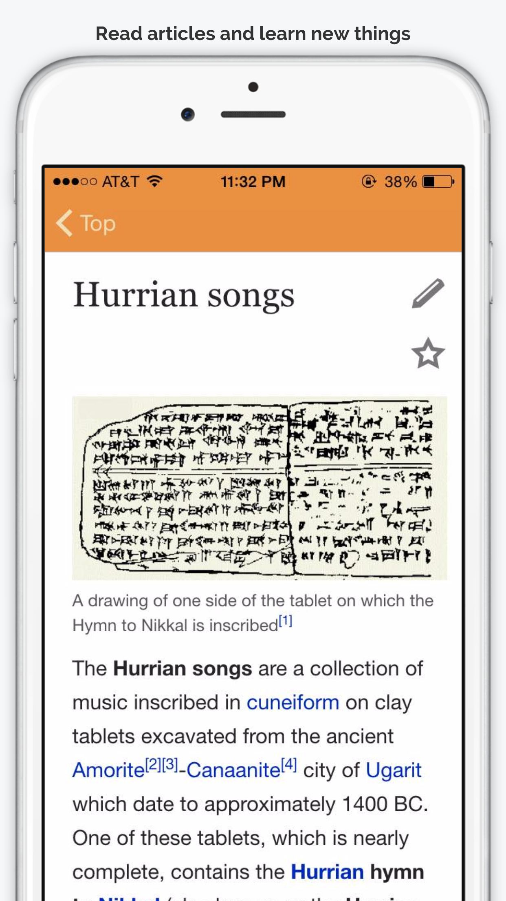

iHackerNews
====

iHackerNews is an iOS application that provides user with better reading experience by offering bookmark feature for free. Registered members can mark any post they like and those posts will be categorized as favorite and ordered by time so that everyone can access them at anytime and quickly find their desired article based on time. (Ruby on Rails as back-end server)

screenshots
---

--------------

--------------

-------------

-----------------

----------------

